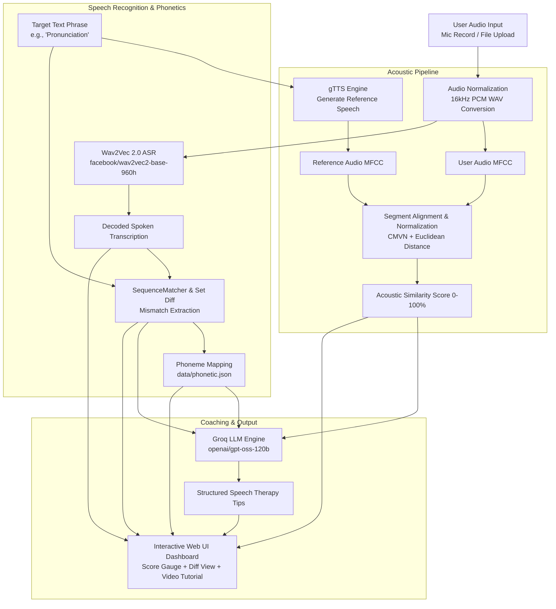

# 🎙️ Speaky AI • Pronunciation Checker & Speech Lab

An end-to-end intelligent pronunciation assessment and speech coaching system powered by **Flask**, **Wav2Vec 2.0 Automatic Speech Recognition (ASR)**, **Mel-Frequency Cepstral Coefficients (MFCC)** acoustic modeling, and **Groq LLM Speech Therapist Guidance**.

---

## 📑 Table of Contents
1. [System Architecture](#-system-architecture)
2. [Deep Dive: Automatic Speech Recognition (Wav2Vec 2.0)](#-deep-dive-automatic-speech-recognition-wav2vec-20)
3. [Deep Dive: Acoustic Modeling & MFCC Similarity](#-deep-dive-acoustic-modeling--mfcc-similarity)
4. [Deep Dive: Sound & Letter Mismatch Finding Algorithm](#-deep-dive-sound--letter-mismatch-finding-algorithm)
5. [AI Speech Coaching Engine (Speaky & Groq)](#-ai-speech-coaching-engine-speaky--groq)
6. [Project File Structure](#-project-file-structure)
7. [API Reference](#-api-reference)
8. [Getting Started & Installation](#-getting-started--installation)

---

## 🏛️ System Architecture



---

## 🧠 Deep Dive: Automatic Speech Recognition (Wav2Vec 2.0)

Speaky AI utilizes the **`facebook/wav2vec2-base-960h`** model to perform speech-to-text recognition directly from the user's recorded waveform without relying on external cloud APIs.

```
Raw Audio (16kHz) 
  ───► [1D Temporal CNN Encoder] 
  ───► [Latent Vectors z_t] 
  ───► [Transformer Encoder (12 Layers, 768 Dim)] 
  ───► [Linear Projection Layer] 
  ───► [CTC Argmax Decoding] 
  ───► Normalized Text Output
```

### 1. Convolutional Feature Encoder
- The raw audio vector $X$ sampled at $16\text{ kHz}$ is passed through a multi-layer 1D temporal convolutional neural network.
- The encoder contains 7 blocks of temporal convolutions with kernel sizes $(10, 3, 3, 3, 3, 2, 2)$ and strides $(5, 2, 2, 2, 2, 2, 2)$.
- This downsamples the raw $16\text{ kHz}$ signal by a factor of $320$, producing latent feature representation vectors $\mathbf{z}_t$ every $20\text{ ms}$ with a receptive field of $25\text{ ms}$.

### 2. Contextualized Transformer Architecture
- The latent feature vectors $\mathbf{z}_t$ are fed into a 12-layer Transformer encoder with a hidden dimension size of $768$ and $8$ attention heads.
- Self-attention captures long-range phonetic and contextual dependencies across the spoken utterance:
$$\text{Attention}(Q, K, V) = \text{softmax}\left(\frac{QK^T}{\sqrt{d_k}}\right)V$$

### 3. Connectionist Temporal Classification (CTC) Decoding
- The Transformer outputs are projected to the vocabulary distribution $P(l_t | \mathbf{x})$ over 32 tokens (letters `a-z`, space, apostrophe, and CTC blank symbol $\epsilon$).
- Speaky decodes the most likely emission sequence using greedy CTC argmax decoding:
$$\hat{l}_t = \arg\max_{l} P(l | \mathbf{h}_t)$$
- The CTC collapse function removes consecutive duplicates and blank tokens $\epsilon$, producing the final, lower-cased phonetic transcription string.

---

## 📊 Deep Dive: Acoustic Modeling & MFCC Similarity

To grade articulation quality and pronunciation clarity, Speaky extracts **Mel-Frequency Cepstral Coefficients (MFCCs)** from both the native reference speech (generated via `gTTS`) and the user's audio.

```
Audio Waveform 
  ──► [Pre-emphasis] 
  ──► [Framing & Hamming Window] 
  ──► [FFT / Power Spectrum] 
  ──► [Mel Filterbank (13 Filters)] 
  ──► [Log Energy] 
  ──► [Discrete Cosine Transform] 
  ──► [CMVN Normalization] 
  ──► MFCC Matrix
```

### 1. Pre-emphasis & Framing
- A high-pass pre-emphasis filter amplifies high-frequency formant energies:
$$y[n] = x[n] - \alpha x[n-1], \quad \alpha = 0.97$$
- The continuous signal is segmented into overlapping frames of length $N = 2048$ samples with hop length $H = 512$ samples ($25\text{ ms}$ frame with $10\text{ ms}$ step).
- A Hamming window $w[n]$ is applied to each frame to minimize spectral leakage at the boundaries:
$$w[n] = 0.54 - 0.46 \cos\left(\frac{2\pi n}{N-1}\right)$$

### 2. Fast Fourier Transform (FFT) & Mel Filterbank
- The Discrete Fourier Transform (DFT) converts each windowed frame from the time domain to the frequency spectrum:
$$X_k = \sum_{n=0}^{N-1} x[n] w[n] e^{-j \frac{2\pi k n}{N}}$$
- The frequency scale is converted to the psychoacoustic **Mel scale**, matching the non-linear human ear perception of pitch:
$$m = 2595 \log_{10}\left(1 + \frac{f}{700}\right)$$
- $M = 13$ triangular overlapping Mel-spaced bandpass filters are applied to the power spectrum $|X_k|^2$.

### 3. Discrete Cosine Transform (DCT) & Cepstral Normalization
- The logarithm of the filterbank energies is decorrelated using the Discrete Cosine Transform (DCT-II) to extract the first 13 cepstral coefficients:
$$c_n = \sum_{m=1}^{M} \log(S_m) \cos\left[ \frac{\pi n}{M} \left(m - \frac{1}{2}\right) \right]$$
- **Cepstral Mean and Variance Normalization (CMVN)** is applied across all coefficients to eliminate static microphone gain and channel distortion:
$$\hat{C}_{i, t} = \frac{C_{i, t} - \mu_i}{\sigma_i + \epsilon}$$

### 4. Segment Dynamic Distance & Similarity Score
- The normalized MFCC matrices from the reference audio and user audio are divided into temporal sub-segments of length $L = 20$.
- Each sub-segment pair is zero-padded along axis 1 to matching duration, and the Euclidean distance is computed:
$$d_k = \|\mathbf{S}_{\text{ref}}^{(k)} - \mathbf{S}_{\text{user}}^{(k)}\|_2$$
- The overall acoustic distance is mapped to a calibrated percentage score:
$$\text{Score} = \text{clip}\left(\left[\frac{d_{\max} - d_{\text{avg}}}{d_{\max} - d_{\min} + \epsilon} \times 2.0 + 0.1\right] \times 100, 0, 100\right)$$

---

## 🔍 Deep Dive: Sound & Letter Mismatch Finding Algorithm

Speaky combines **Set-Theoretic Mismatch Detection** and the **Ratcliff-Obershelp (Gestalt Pattern Matching)** sequence alignment algorithm to accurately detect substituted, omitted, or mispronounced sounds.

```
Target Text:     [ P ][ R ][ O ][ N ][ U ][ N ][ C ][ I ][ A ][ T ][ I ][ O ][ N ]
Recognized ASR:  [ P ][ R ][ O ][ N ][   ][ N ][ S ][ I ][ A ][ T ][ I ][ O ][ N ]
                 ─────────────────────────────────────────────────────────────
Alignment Tags:  [MATCH][MATCH][MATCH][MATCH][DEL][MATCH][REPLACE][MATCH]...
Mispronounced:   Sound 'u', Sound 'c'
```

### 1. Sound Extraction & Alignment
- **Character Mismatch Set**: Computes missing alphabetic sounds between the target canonical representation and user transcription:
$$\text{Mismatches} = \{c \in \text{Target} \mid c \notin \text{ASR Transcription}\}$$
- **Sequence Matching (Ratcliff-Obershelp)**:
  - Finds the longest contiguous matching sub-string between the target and recognized tokens.
  - Recursively matches remaining left and right pieces.
  - Identifies specific edit opcodes: `replace`, `delete`, `insert`, and `equal`.
  - Tags individual words and character groups that deviated from correct pronunciation.

### 2. Phonetic Dataset Mapping
- Detected mismatched letters are mapped against `data/phonetic.json`.
- When a matching phonetic sound is identified (e.g. `θ`, `ʃ`, `ʧ`, `æ`, `r`, `z`), the system automatically retrieves:
  - Exact start timestamp ($t_{\text{start}}$) and end timestamp ($t_{\text{end}}$).
  - Direct YouTube speech therapy video player URL for interactive visual mouth movement demonstration.

---

## 🤖 AI Speech Coaching Engine (Speaky & Groq)

When pronunciation mismatches are identified, Speaky sends the target phrase, spoken transcription, and mismatched sounds to **Groq LLM** (`openai/gpt-oss-120b`) using the OpenAI SDK integration.

### Prompt Formulation
The system prompt instructs the AI speech therapist to return a pediatric-friendly, step-by-step coaching breakdown:
1. **Warm Greeting**: Encouraging and empathetic tone.
2. **Mouth & Tongue Positioning**: Explicit instructions on where to place the tongue (alveolar ridge, teeth, palate) and how to shape the lips.
3. **Syllable Breakdown**: Sound-by-sound phoneme segmentation (e.g. *Pro-nun-see-ay-shun*).
4. **Vocal Exercise**: 10-second mirror practice technique and positive reinforcement.

### Resilient Fallback Engine
If the network is unavailable or API quotas are exceeded, the built-in fallback rules engine automatically generates structured mouth movement guides, ensuring 100% uptime.

---

## 📁 Project File Structure

```
/
├── app.py                   # Flask Application Backend (/check-pronunciation, /tts, & /)
├── services/
│   ├── __init__.py          # Services package initializer
│   ├── audio_processor.py   # MFCC feature extraction, audio conversion & acoustic similarity
│   ├── transcriber.py       # Wav2Vec 2.0 ASR speech recognition & mismatch analysis
│   └── therapist.py         # AI Speech therapist engine (Groq LLM + offline fallback)
├── data/
│   └── phonetic.json        # Phonetic timestamps and speech therapy video mappings
├── templates/
│   └── index.html           # Modern interactive UI for recording, testing & visualization
├── static/
│   ├── css/
│   │   └── style.css        # Responsive glassmorphic dark theme stylesheet
│   └── js/
│       └── app.js           # Live recording, visualizer canvas, API calls, results renderer
├── requirements.txt         # Project dependencies
├── .env.example             # Environment configuration template
├── .gitignore               # Excludes secrets, temporary audio files, and cache
├── dockerfile               # Docker container configuration
└── README.md                # In-depth technical documentation
```

---

## 📡 API Reference

### `POST /check-pronunciation`
Evaluates the user's spoken audio against a target word or phrase.

**Headers:**
- `Content-Type: multipart/form-data`

**Body (Form Data):**
| Parameter | Type | Required | Description |
|---|---|---|---|
| `text` | string | Yes | The canonical target word/phrase to practice (e.g., `"Pronunciation"`) |
| `audio` | file/blob | Yes | Spoken audio file (`.webm`, `.wav`, `.mp3`, `.m4a`, `.ogg`) |

**Sample Response (`200 OK`):**
```json
{
  "similarity": 84.5,
  "target_text": "Pronunciation",
  "transcription": "pronunsation",
  "mis_matchings": ["c", "i"],
  "mismatched_words": ["pronunsation"],
  "tips": "### 👋 Hi there! I'm Speaky, your speech coach!\n\nLet's work together on **Pronunciation**:\n1. **For the 'c' (soft /s/ or /ʃ/) sound**: Place the tip of your tongue near the ridge behind your upper teeth and blow a steady stream of air.\n2. **Practice slowly**: *Pro - nun - see - ay - shun*.\n3. **Quick Exercise**: Say 'see... see... see' in front of a mirror! You're doing amazing! 🌟",
  "videos": [
    {
      "phoneme": "c",
      "url": "https://www.youtube.com/embed/wBuA589kfMg?start=94&end=97&autoplay=0",
      "direct_url": "https://www.youtube.com/watch?v=wBuA589kfMg&t=94s",
      "start_time": 94,
      "end_time": 97
    }
  ]
}
```

---

### `GET /tts` / `POST /tts`
Streams reference native pronunciation audio for a given word or phrase.

**Parameters:**
- `text` *(string, query or form field)*: Target text

**Response:**
- `audio/wav` stream

---

## 🚀 Getting Started & Installation

### 1. Prerequisites
- **Python 3.10+**
- **FFmpeg** (optional, recommended for hardware audio conversion)

### 2. Clone & Install
```bash
git clone https://github.com/Janani-N14/Speaky.git
cd Speaky
pip install -r requirements.txt
```

### 3. Environment Variables
Create a `.env` file based on `.env.example`:
```env
PORT=5000
GROQ_MODEL=openai/gpt-oss-120b
GROQ_API_KEY=your_groq_api_key_here
```

### 4. Run the Server
```bash
python app.py
```

### 5. Access the Web Application
Open your browser and navigate to:
👉 **[http://localhost:5000](http://localhost:5000)**
